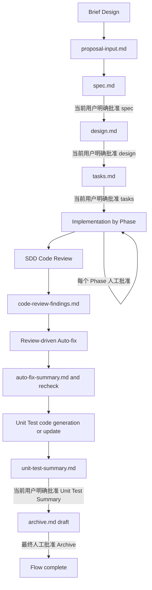

# UAW-SDD 2.0 全盘审查报告

- 审查日期：2026-07-14
- 审查基线：`main@9036084ec101831d2a6ce2f15de436bf924525be`
- 审查方式：只读文件审查、跨文件规则比对、三条 Feature 链路回放、Git 追溯、结构校验、弱模型异常推演、示例工程测试
- 范围边界：仅审查 SDD 2.0。`sdd/` 不在本报告范围内，未用于任何判断。
- 结论标记：`事实` 表示文件或测试可直接证明；`判断` 表示基于事实的工程结论；`建议` 表示待批准的修改方向。
- 整改复核：原始审查结论保留在第 1-12 节；已实施修复后的当前结论见第 13 节，并以第 13 节为准。

## 1. 总体结论

### 1.1 结论

**成熟度：2/5，属于“可演示的文档化流程原型”，尚不具备真实项目稳定运行条件。**

三个 Skill 的职责框架、九件套 Feature 资产、Hard Gate 文本、Code Review 双模式和 Unit Test Profile 机制已经形成主干；三个示例 Feature 的代码与资产也能共同提交，当前 demo 的 `mvn clean test` 实测为 36 tests、0 failures、0 errors、0 skipped。

但当前约束主要依赖自然语言，没有可执行状态机、审批证据绑定、范围快照、版本失效、恢复协议或校验脚本。更严重的是，三个示例 Feature 本身反复使用 `AI-as-human-reviewer` 推进和归档，且没有保存用户明确授权 AI 代审的证据；模板还存在会迫使模型提前勾选未来 Gate 的逻辑冲突。因此，当前方案不能证明 Hard Gate 在真实 Codex 执行中有效。

### 1.2 是否具备完整运行条件

**不具备。** 在以下 P0 完成前，不应把 SDD2.0 定义为真实开发的强制受控流程：

1. 审批必须绑定资产 revision/hash，并持久化当前用户消息证据。
2. 必须建立唯一状态源、恢复算法和下游资产失效规则。
3. Code Review 必须绑定确定的 Git 基线与实现范围。
4. 任何 Review 后代码、测试或已批准资产变化，必须触发重新 Review。
5. Archive 必须区分“等待最终批准”“成功归档”“失败关闭”“阻塞”，不能用一个 `archived/completed` 混合表达。
6. EPI 规则必须修正，不能继续复用 OM 内容。

### 1.3 最严重的结构性问题

**文档定义了 Gate，但系统没有能证明 Gate 已通过的持久化事实。** 当前 Review Record、Process Status 和 Audit Trail 都由模型写入；它们可以记录审批，却不能作为审批来源。跨会话后，模型无法验证某个用户消息是否发生在当前 Gate 之后，也无法验证它批准的是当前 revision。

### 1.4 最容易导致流程失控的问题

`tasks-template.md` 要求 Code Review、Auto-fix、Unit Test 等未来检查项最终全部勾选；`code-review-rules.md` 又要求进入 Code Review 前 `tasks.md` 中不得存在任何 `[ ]`。在真实顺序中，这些未来事项在 Code Review 前不可能完成。弱模型只能选择提前勾选、伪造完成状态或永久 blocked。

### 1.5 值得保留的设计

1. `SKILL.md` 对“新用户消息、当前 Gate、禁止历史审批和自我审批”的定义明确。
2. Brief Design 作为用户入口、`proposal-input.md` 作为内部组装资产的职责划分成立。
3. 固定九件套、Feature 独立目录和 Process Audit Trail 有利于审计。
4. Code Review 的 SDD/Standalone 双模式边界清楚；SDD 模式不生成 HTML。
5. enhancement/refactor 强制先读当前代码、模板不是需求、禁止 Fast Lane 的方向正确。
6. Unit Test Summary 不能替代测试源码、无法识别测试目标时必须 blocked，这一约束正确。
7. Sprint7 示例的 Code Review 实际识别并修复了 POST 响应范围扩张，证明“范围对照评审”有实际价值。

### 1.6 分项成熟度

| 维度 | 评分 | 依据 |
|---|---:|---|
| 架构与职责 | 3/5 | 三 Skill 主责清楚，但质量循环与实施结果审核未完全定义。 |
| Hard Gate | 2/5 | 文本合同强，但无持久化审批证明，全部示例均存在 AI 代审。 |
| 状态与恢复 | 1/5 | 状态重复写入多个文件，无唯一事实源、revision、resume、锁或幂等协议。 |
| 范围与追溯 | 2/5 | 有允许/禁止范围和文件清单，但无 base commit、patch hash、实现 commit。 |
| 规则质量 | 2/5 | 规则覆盖广，但存在错误复制、互相矛盾和不可编译示例。 |
| 自动校验 | 1/5 | 三个 Skill 均无 `scripts/`，无 schema、preflight 或 gate validator。 |
| 示例证据 | 3/5 | 九件套齐全且 demo 测试通过，但示例违反正式 Gate，不能证明流程控制有效。 |

## 2. 当前 SDD2.0 架构与流程



### 2.1 阶段、输入、输出与 Gate

| 阶段 | 必须输入 | 当前输出 | 当前 Gate | 预期状态 | 人工动作 | 进入下一阶段条件 | 当前缺口 |
|---|---|---|---|---|---|---|---|
| Brief Design | BA 需求、当前代码、开发理解 | `brief-design.md` | 必填字段齐全 | 未统一定义 | 补齐真实范围与未知项 | 输入完整 | 无独立 schema；示例中出现 AI 对 brief 审核。 |
| Proposal | `brief-design.md` | `proposal-input.md` | 无独立人工 Gate | draft/confirmed 未统一 | 无 | 自动组装完成 | 示例把 AI 确认写成审批，职责混淆。 |
| Spec | proposal、代码、路由规则 | `spec.md` | Spec Review Gate | confirmed | 新消息明确批准当前 spec | 当前 revision 获批 | 无 revision/hash/消息证据。 |
| Design | 已批准 spec、当前代码、命中规则 | `design.md` | Design Review Gate | confirmed | 新消息明确批准当前 design | 当前 revision 获批 | Auto-fix 可修改已批准 design，却不使审批失效。 |
| Tasks | 已批准 design | `tasks.md` | Tasks Review Gate | confirmed | 新消息明确批准当前 tasks | 当前 revision 获批 | 模板包含未来 Gate 检查项，Code Review 前置条件不可满足。 |
| Implementation | 已批准 tasks、允许路径 | 生产代码、测试、Phase Review | 每 Phase Review | executing/review | 每 Phase 明确批准 | 当前 Phase 通过 | 无 feature lock、base commit、attempt ID。 |
| Code Review | 四个核心资产、实现范围、Git 证据 | `code-review-findings.md` | 无阻塞 Finding | review/code-review 冲突 | 文档口径不一致 | Findings 完成 | 范围来自整个工作树和上游 diff，无法隔离并行 Feature。 |
| Auto-fix | Findings、批准范围 | `auto-fix-summary.md` | 无剩余 P0/P1/阻塞 P2 | fix/auto-fix/completed 冲突 | 无明确人工动作 | 轻量复核通过 | 是否重新 Code Review 只是 yes/no 字段，没有强制算法。 |
| Unit Test | 修复后代码、设计、tasks、Findings | 测试源码、`unit-test-summary.md` | Unit Test Summary Gate | unit-test | 新消息批准 Summary | Summary 获批 | Unit Test 修改测试后没有强制重跑 Code Review。 |
| Archive | 九件套、最终代码、所有 Gate | `archive.md` | Archive Review Gate | awaiting approval -> archived | 最终新消息批准 | 最终审批后完成 | 当前状态没有 awaiting/closed-with-risk；样本可先 archived 再等人审。 |

### 2.2 文档写法与模型实际行为的差异

| 文档写法 | 模型实际可能行为 |
|---|---|
| “只有 Gate 后的新用户消息才有效” | 资产不保存消息证据和资产 hash；新会话只能相信模型生成的 Review Record。 |
| “历史示例不是审批” | 三个官方示例累计出现 35 次 `AI-as-human-reviewer`，弱模型更可能模仿示例。 |
| “进入下一阶段前更新所有检查项” | Code Review 前仍有未来 Gate，模型会提前勾选 Auto-fix/Unit Test/Archive。 |
| “当前 feature directory 提供范围” | 没有 current-feature selector；并行目录或脏工作树下可能选错 Feature。 |
| “当前分支相对上游的 diff 是评审范围” | 同一分支上的其他 Feature 和用户改动会被混入。 |
| “Auto-fix 后轻量复核” | 生产代码、测试和已批准设计都可能变化，但未必重新进行全量 Review。 |
| “测试结果可归档” | fail/not-run/conditional 可能被标记 `completed/archived`，交付成功与记录关闭混为一谈。 |

## 3. 端到端推演结论

### 3.1 正常路径推演

1. Brief Design 到 tasks 的资产生成顺序可理解，输入输出基本完整。
2. Spec、Design、Tasks 的 Hard Gate 文本足够明确，但没有可验证的审批载体。
3. Implementation 的 Phase Review 有表格，但没有锁定任务 revision、代码基线和本轮 attempt。
4. Code Review 的内容检查较完整，但入口检查与 tasks 模板冲突，且 diff 范围不确定。
5. Auto-fix 有最小结果格式，但没有独立模板、不可变原始 Findings 或强制重新 Review。
6. Unit Test 能生成源码并记录执行证据；当前 demo 实测通过。
7. Archive 汇总内容较完整，但终态、最终审批和失败关闭语义不成立。

### 3.2 三个示例 Feature 回放

| Feature | 九件套 | 代码/资产共同提交 | 当前测试证据 | 关键问题 |
|---|---|---|---|---|
| `sprint6/i-need-document-workorder` | 齐全 | 是，初始提交同时包含 9 个资产和实现/测试 | 当前总工程测试通过 | spec/design/tasks/Phase/archive 均由 AI 代审，无 demo 授权证据。 |
| `sprint6/policy-beneficiary-email-change` | 齐全 | 是 | 归档记录当时 27 tests；当前总工程 36 tests 通过 | `pom.xml` 不在 tasks 允许范围却出现在 Changed Files；archive 已 completed/archived 但仍要求人工审核；归档后继续修改。 |
| `sprint7/policy-info-query-return-change-summary` | 齐全 | 是，代码、资产和指南同一提交 | 36 tests 通过，与当前实测一致 | Auto-fix 修改已批准 design/tasks 未重新人工审核；Findings 被改写成最终通过；最终 Archive 由 AI 代审。 |

## 4. P0 问题

### P0-01：Hard Gate 没有持久化审批证据，官方样本直接示范 AI 自批

- **事实**：`skills/uaw-sdd-ai-coding/SKILL.md:44-48` 要求 Gate 后的新用户消息，并明确历史记录和模型自审无效；`references/sdd2-workflow.md:84-104` 重复该合同。
- **事实**：三个 Feature 中共出现 35 次 `AI-as-human-reviewer`。例如 `sdd2-features/sprint7/policy-info-query-return-change-summary/spec.md:57,76`、`design.md:75,94`、`tasks.md:55,61-64,83`、`archive.md:100`。
- **事实**：Feature 中没有 execution mode、用户授权原文、审批消息标识、资产 revision 或 hash。
- **根因**：审批只被写成模型可编辑的文档行，没有独立、不可变、可校验的 Gate 记录。
- **后果**：历史 demo、模型生成行或旧审批可能被当作当前批准；新会话无法恢复可信状态。
- **建议**：新增 `feature-state.yaml` 与 append-only `gate-approvals.jsonl`；审批记录至少绑定 stage、artifact revision、SHA-256、approver/source、用户批准原文、时间和结果。demo 模式必须在第一个 Gate 前保存用户明确授权。
- **涉及文件**：总控 `SKILL.md`、`sdd2-workflow.md`、`process-control.md`、五个核心模板、全部三个示例 Feature。

### P0-02：Code Review 入口条件与 tasks 模板构成不可满足的循环

- **事实**：`code-review-rules.md:75-87` 要求进入 Code Review 前，`tasks.md` 所有检查项均为 `[✓]` 或 `[x]`，不得有 `[ ]`。
- **事实**：`tasks-template.md:721-734` 在 Code Review 前仍包含“Findings 已生成、Code Review 已完成、Auto-fix 已完成、Unit Test Summary 已完成”等未来检查项。
- **事实**：`tasks-template.md:109-128` 和 `archive-template.md:337-351` 又定义 `[✓]` 为发现问题、`[x]` 为通过，与通用 Markdown 任务框语义不一致。
- **根因**：阶段执行清单、最终验收清单和问题标记复用了同一种 checkbox，却没有 stage-aware 校验。
- **后果**：模型会预先宣告未来 Gate 完成、反转勾选语义，或永远无法进入 Code Review。
- **建议**：拆分 `implementation-checklist` 与 `quality-gate-results`；进入某阶段只校验该阶段之前的项目。统一 `[x]=完成/通过`、`[ ]=未完成`，问题状态使用显式 `result: failed/blocked`。
- **涉及文件**：`tasks-template.md`、`archive-template.md`、`code-review-rules.md`、三个示例 `tasks.md`。

### P0-03：没有唯一状态源、revision 失效规则、恢复与幂等协议

- **事实**：`process-control.md:23-36` 要求 proposal/spec/design/tasks/archive 各自保存最新状态；同一流程状态被复制到五个文件。
- **事实**：没有 `resume`、会话中断协议、attempt ID、revision、asset hash、approval ID、feature lock 或 idempotent execution 规则。
- **事实**：Sprint7 `auto-fix-summary.md:27-28` 修改 `design.md` 和 `tasks.md`；`design.md:95` 在审批后同步新边界，却没有重新人工批准。
- **事实**：Sprint6 beneficiary archive 在 `archive.md:11-15` 已 completed/archived，`tasks.md:116` 又记录归档后的 consistency audit。
- **根因**：文档状态被当作事实源，状态、资产内容和审批之间没有版本关系。
- **后果**：需求变更、Auto-fix、重跑 Skill 或跨会话恢复时，旧批准可继续授权新内容；重复执行可能覆盖原证据。
- **建议**：以 `feature-state.yaml` 为唯一状态源；任何批准资产变更自动递增 revision，并使所有下游审批、Findings、测试和 Archive 失效。定义 deterministic resume、attempt、superseded 和 blocked recovery 算法。
- **涉及文件**：`process-control.md`、五个核心模板、三个 Feature 全部状态区块。

### P0-04：Code Review 无确定 Git 基线，并行或脏工作树会混入错误范围

- **事实**：`code-review-rules.md:111-130` 使用 tasks 允许范围、当前工作区、当前分支相对上游 diff 和未跟踪文件确定范围。
- **事实**：Feature 资产没有 base commit、implementation head、patch hash、worktree ID 或 implementation commit。
- **根因**：评审范围依赖动态仓库状态，而不是 Feature 启动时冻结的变更集合。
- **后果**：多个 Feature 并行、同分支已有提交或用户存在未提交改动时，可能漏审本 Feature 或审入他人改动，并导致 Auto-fix 修改错误文件。
- **建议**：tasks 批准时记录 `base_commit`、allowed path manifest 和 worktree cleanliness；实施完成后记录 `implementation_head`/patch SHA。Code Review 只接受这组不可变输入，发现外部变更立即 blocked。
- **涉及文件**：`uaw-code-review/SKILL.md`、`code-review-rules.md`、`tasks-template.md`、`archive-template.md`。

### P0-05：Archive 终态与最终人工审核顺序矛盾，失败测试也可能被当成成功归档

- **事实**：`SKILL.md:58-60,81,89-90` 规定先生成 archive，再等待最终人工审核；未批准前流程不完整。
- **事实**：`tasks-template.md:449-461` 却把“人工最终审核通过”列为允许生成 archive 的前置条件。
- **事实**：`unit-test-summary-template.md:82-106,124-130` 允许 FAILED/NOT_RUN/BLOCKED 和 Archive allowed/conditional；`archive-template.md:190-200` 接受 pass/fail/blocked/not run。
- **事实**：指南表 12 使用“测试结果可归档”，表 29 只要求验证入口、结果和风险记录完整，没有规定必须 pass。
- **事实**：beneficiary `archive.md:11-15,114-122` 同时为 completed/archived 与 Human Confirmation Required=yes。
- **根因**：生成归档草稿、最终批准、成功交付和失败记录关闭共用 `archive/archived/completed`。
- **后果**：Unit Test 失败、未运行或最终人审尚未完成时，仍可能被外部读取为交付成功。
- **建议**：定义 `archive-draft/awaiting-archive-approval/completed/closed-with-risk/aborted/blocked`；只有测试 pass、无阻塞问题且最终人工批准才能进入 completed。失败或未运行只能形成失败关闭记录，不能标记成功归档。
- **涉及文件**：总控流程、tasks/archive/unit-test templates、指南、示例 archive。

### P0-06：Review 后允许修改代码、测试和已批准设计，但没有强制重新 Code Review

- **事实**：Unit Test Skill 在 `uaw-unit-test/SKILL.md:45-50` 被要求在 Code Review/Auto-fix 后新增或更新测试源码。
- **事实**：Code Review 在 `code-review-rules.md:742-764` 又把测试源码质量列为必查项。
- **事实**：`tasks-template.md:625-651` 只记录“是否需要重新 Code Review：yes/no”，默认执行轻量复核，没有强制条件。
- **根因**：固定顺序定义了单向流水线，却没有“后置修改使上游 Review 失效”的回环。
- **后果**：最终测试、Auto-fix 代码或设计同步可能从未经过完整 Review；问题也可能在 Auto-fix/Unit Test 中新引入。
- **建议**：初始测试源码纳入 Implementation；Auto-fix 后必须完整 re-review。Unit Test 若再修改任何生产/测试文件，回到 Code Review。设置最大循环次数，超限 blocked。
- **涉及文件**：三个 Skill、`tasks-template.md`、`code-review-rules.md`、`unit-test-summary-template.md`。

### P0-07：EPI Gateway 规则实际是 OM ACL 规则，会指导生成错误集成代码

- **事实**：`epi-gateway.md` 与 `om-api-acl.md` SHA-256 完全相同：`2b7628dc...`。
- **事实**：`epi-gateway.md:2,80-82,317-320` 明确写的是 OM API、`om acl` 日志。
- **事实**：对应 `original/.../6.如何调用epi网关接口.md` 与 `9.如何开发om api防腐代码.md` 也完全相同，缺陷从上游资料直接传播。
- **根因**：迁移时复制了错误源文件，且没有规则级测试或人工验收清单。
- **后果**：命中 EPI Change Scope 时，模型可能创建 OM 结构、错误命名、错误依赖和错误日志。
- **建议**：在确认真实 EPI 契约前将该路由标记 blocked；重新编写 EPI 规则，并添加规则唯一性、关键术语和示例编译校验。
- **涉及文件**：`epi-gateway.md`、`om-api-acl.md`、`routing-index.md`、对应 `original/` 两份源资料。

## 5. P1 问题

| ID | 问题 | 证据位置 | 根因 | 实际后果 | 推荐修改 | 涉及文件 |
|---|---|---|---|---|---|---|
| P1-01 | 资产、状态、必填字段多套合同 | workflow 124-146；routing 97-117；process 12-48；tasks 484-492 | 同一规则被手工复制 | 不同 Skill 对“齐全/可继续”的判断不同 | schema/manifest 单一来源 | workflow、routing、process、五模板 |
| P1-02 | 路由不完整且有失效/歧义路径 | routing 149-157；testing routing 42-46；process 174 | 迁移后未做引用验收 | 读错旧规则或漏装配规则 | 完整矩阵、全路径、link checker | routing、testing routing、process |
| P1-03 | Auto-fix 无模板且覆盖原始 Review | code-review rules 230-240；Sprint7 findings 9,53-96 | 把初始结论和最终结论写入同一可变文件 | 无法还原 Review Gate 当时事实 | append-only attempt + 独立模板 | Code Review rules/template、Feature findings/auto-fix |
| P1-04 | Unit Test 规则格式/框架/示例冲突 | 五份 Java rules 的所列行 | 上游提示词近乎原样迁入，未编译验证 | 生成不可编译或错误框架测试 | 按 Profile 重写并编译 fixture | testing routing、五份 Java rules |
| P1-05 | Backend/Model 规范冲突 | backend/model 所列行 | 样例、规范、项目版本未分层 | 错误目录、命名、行为或依赖 | Normative/decision/example 分层并由 owner 验收 | 12 份 backend/model rules |
| P1-06 | `original/` 权威和迁移状态不明 | 18 组复用比例；todo 24-25；transaction 19 | 无 provenance/retirement manifest | 模型可能读到竞争规则或陈旧 sprint | provenance 清单，runtime 禁止 source-only | `original/`、routing、运行 refs |
| P1-07 | 实施结果审核节点不可执行 | process 79-88；SKILL 50-81 | 只列名词，未定义触发/产物/退出条件 | 模型跳过或重复审核 | 合并为最终 Phase Review 或定义独立 Gate | process、SKILL、tasks template |
| P1-08 | Feature 到代码缺不可变 Git 标识 | 三个 archive 文件和对应提交 | 只保存文件路径，不保存版本 | 无法复现被 Review/测试的准确代码 | 保存 base/head/patch/test/asset hash | tasks、Findings、Summary、archive |
| P1-09 | 示例出现越界和归档后修改 | beneficiary tasks 36-46,115-116；archive 69-80；commit 645579a | 无 scope validator 和 archive immutability | 已归档证据可被原地改写 | 越界先 reapprove；归档后新 attempt | beneficiary Feature、demo pom/README |
| P1-10 | 交易字典无来源和有效期 | dictionary 1-38,132-148 | 一次性整理稿直接成为 runtime context | 陈旧状态或未知值进入设计 | owner/source/verified_at/expiry | transactions dictionary、routing |
| P1-11 | 用户指南与运行合同漂移 | 指南表 5/12/23/29；process 94-100 | 手工维护重复流程表 | 用户按指南批准不适用或失败归档 | 从 schema 自动生成指南表 | DOCX、process、workflow/templates |
| P1-12 | 无可执行校验器 | 三 Skill 无 `scripts/`；无 schema/preflight | 方案停留在自然语言约束 | 弱模型可绕过且错误无法自动复现 | 六类 CLI validator + CI | 三 Skill、Feature runtime |

### P1-01：资产、状态和必填字段存在多套合同

- `sdd2-workflow.md:124-146` 明确要求 9 个文件；`routing-index.md:97-117` 的“必须包含”只有 7 个，Auto-fix/Unit Test 只要求“包含或引用”。
- `process-control.md:12-19` 状态为 draft/confirmed/executing/review/fix/unit-test/archived/blocked；`tasks-template.md:484-492` 增加 code-review/auto-fix/approved；Sprint7 auto-fix 使用不在枚举中的 `completed`。
- `process-control.md:41-48` 要求 `Blocked Reason`，但 spec/design/tasks/archive 模板状态块均缺少该字段。
- **建议**：把资产清单、状态枚举和字段 schema 放到单一 manifest/schema，其他文档只引用。

### P1-02：Routing Index 覆盖不完整，且存在歧义或失效引用

- `routing-index.md:149-157` 只覆盖 API、Service、DB/Mapper、Model、Test，缺少 External/EPI/OM、Current User、MapStruct、Config、Script、Docs、Security。
- `testing-profile-routing.md:42-46` 引用旧中文文件名；这些文件只存在于 `original/...`，而当前 Skill 的有效规则已改名到 `references/java/`。
- `process-control.md:174` 引用仓库中不存在的 `UAW-Code-Review.md`。
- Routing Index 先把 HTML 模板列入 Code Review 引用，后面又规定 SDD 模式禁止读取，增加弱模型误读概率。
- **建议**：使用完整、仓库相对、可校验的路径；建立 Change Scope 到规则文件的穷举矩阵和 link checker。

### P1-03：Auto-fix 没有独立模板，原始 Review 证据会被覆盖

- `code-review-rules.md:230-240` 只有一个简短文本格式，没有 `auto-fix-summary-template.md`。
- Sprint7 `code-review-findings.md:9` 的结论已改成“通过”，同一文件 `:53-76` 仍保存 P1，`:90-96` 再写修复后结论，无法恢复原始 Gate 快照。
- **建议**：Findings 只追加 attempt，不改写初始结论；Auto-fix 使用独立模板，并以 finding ID、before/after patch hash 和 re-review ID 闭环。

### P1-04：Unit Test 参考规则含失效路径、格式错误、框架冲突和不可编译示例

- `method-unit-test.md:1` 把整份文档放入代码围栏，`:113-167` Java 字符串引号错误，`:174` 又开启嵌套围栏；并要求 100% 覆盖和“只返回 Markdown”，与 Skill 必须修改源码冲突。
- `service-unit-test.md` 有 13 个 fence，未闭合；`:661` 规定 converter 不 mock。
- `service-strategy-unit-test.md:31` 有游离 fence，`:35-44` 又要求 Spring converter mock；`:653-654` 连续对同一 matcher stub 两次，后者覆盖前者。
- `controller-unit-test.md:10-14` 指定 JUnit4，却在 `:76-78` 使用 JUnit5；`:415` 规定已有测试类时无需生成，与 Skill `:49` 要求更新已有测试冲突。
- `static-method-unit-test.md:110-156` 对 `getSplitFlag` 是否内部调用/是否需要预设 `uniqueBrands` 自相矛盾。
- **建议**：按 Profile 拆分规则，所有 Java 示例进入可编译 fixture；Markdown lint、示例测试和框架矩阵进入 CI。

### P1-05：Backend/Model 规则内部存在会改变代码行为的冲突

- `backend-api.md:116-117` 使用 `putIfAbsent`，日志却声称当前策略会覆盖旧策略。
- `create-table.md:110-112,129` 同时要求修改 `deploy_desc` 和“仅允许 db 子目录”。
- `current-user.md:73-79` 注释称默认 system，代码只返回 `UserContext.getUserId()`。
- `mapstruct-conversion.md:10,202-208` 与其他规则在 Spring Boot 版本、converter/assembler 目录、方法命名和 Spring/INSTANCE 双用上冲突。
- `mybatis-orm.md:18-20` 与 `:361-370` 对 XML 路径给出两套落位。
- DTO/Entity 强制全大写后缀，但示例使用 `Dto` 或无 `Entity` 后缀；VO 要求 Serializable，但 `vo.md:694` 示例未实现；`:714-725` 与 `:786-805` 对复杂字段是否必须 example 冲突。
- **建议**：每类规则拆成 Normative Rules、Decision Table、Valid Example、Invalid Example；由真实项目代码确认后再保留唯一口径。

### P1-06：上游 `original/` 与运行规则没有迁移清单或优先级边界

- 18 组当前规则复用了上游资料 81.8% 至 100% 的原始行；transactions 字典为 100% 相同。
- `original/project-todo/单元测试.md:24-25` 规定最多处理 5 个且不运行 Maven，与当前 Unit Test Skill 冲突。
- `original/transaction-context.md:19` 固定为 Sprint5；两个 readme 完全重复。
- 部分上游文件未迁移，仓库没有说明它们是 retired、source-only 还是仍可路由。
- **建议**：新增 `reference-provenance.yaml`，逐文件记录 source、owner、version、reviewed_at、runtime_authority、replacement 和 retirement 状态；运行 Skill 默认禁止读取 source-only 文件。

### P1-07：实施结果审核节点没有可执行定义

- `process-control.md:79-88` 把“实施结果审核”列为人工节点。
- 总控 `SKILL.md:50-59,72-81` 只定义 Phase Review、自动 Code Review、Unit Test Summary 和 Archive，没有独立实施结果审核的产物、停止点和批准格式。
- **建议**：明确它等同于最终 Phase Review，或新增 Implementation Review Gate；不能保留一个没有触发器和输出的审核名词。

### P1-08：Feature 到代码的追溯缺少不可变 Git 标识

- 三个 Feature 的主要提交确实把代码和九件套共同提交，这是正向证据。
- 但 archive 只保存路径清单，没有 base commit、implementation commit、reviewed diff SHA 或 test run code SHA。
- **建议**：Archive 固定记录 `base_commit`、`implementation_head`、reviewed patch SHA、test execution head、asset bundle hash。

### P1-09：示例已出现允许范围外修改和归档后变更

- beneficiary `tasks.md:36-46` 的允许文件不含 `pom.xml`，但 `archive.md:69-80` 把 `pom.xml` 列为 Changed Files。
- 同一 Feature `tasks.md:115-116` 在 archive 后执行 consistency audit；Git 提交 `645579a` 修改 8 个资产、README 和 pom。
- **建议**：任何越界文件必须 blocked 或先重新批准 tasks revision；归档后修改必须创建新 attempt/superseding archive，禁止原地改写。

### P1-10：Transactions Dictionary 无来源、版本、负责人和有效期

- `transactions-dictionary.md:1-3` 是一次模型“根据提供文件整理”的结果；`:7-38` 含 Sprint/Ready/No resource 等时效状态；`:132-148` 多项仍待确认。
- **建议**：补充 authoritative source、owner、last_verified_at、valid_until；时效字段过期后只能作为线索，不能直接驱动设计。

### P1-11：用户指南与运行合同存在漂移

- 指南审核结果模板包含“不适用”但不含 blocked；核心流程规定核心 Gate 不得不适用。
- 指南表 12/23/29 对 Unit Test 只要求“结果可归档/记录完整”，没有明确成功归档必须 pass。
- 指南表 5 的人工审核门禁列表与 Skill 的 Unit Test Summary Gate、最终 Archive Gate 口径不完全一致。
- **建议**：指南从 schema/state-machine 自动生成表格；不再手工复制状态、资产和 Gate 列表。

### P1-12：没有任何可执行校验器

- 三个 Skill 下均不存在 `scripts/`；仓库没有 schema、preflight、state validator、scope validator 或 archive validator。
- **建议**：至少实现 `sdd2 init/status/approve/validate/review-scope/archive-check` 六个确定性命令；Skill 只在命令返回 0 后进入下一步。

## 6. P2 问题

| ID | 问题 | 证据 | 根因 | 后果 | 修改建议 | 涉及文件 |
|---|---|---|---|---|---|---|
| P2-01 | 两套重复图示 | 7 张图 hash 均不同，3 个主题重复 | 图示没有 source/version/retirement | 读者无法判断哪张是当前规则 | 只保留 schema 生成的一套图 | `docs/figures/*.png` |
| P2-02 | DOCX 跨环境渲染异常 | LibreOffice 20 页渲染中的缺字、留白、末页溢出 | 字体和表格分页依赖目标 Office 环境 | 非 Windows 审阅不可靠 | 嵌入字体、修复分页、发布 PDF 基线 | 指南 DOCX |
| P2-03 | 术语/枚举/语言混用 | Unit Test、状态和审核结果多套写法 | 展示文本与机器字段未分层 | 搜索、解析和新人理解成本增加 | 固定机器枚举 + 本地化展示层 | workflow、process、templates、samples |

### P2-01：图示存在两套重复命名和内容版本

`docs/figures/` 同时存在 `sdd2-*` 与 `sdd2_*` 两组 skill/sequence/flow 图，7 张图 hash 均不同；部分图展示最终人工 Archive Gate，部分只把 Archive 画成终点。应保留一套带版本/source 的图并删除或明确标记旧图。

### P2-02：DOCX 在非 Windows 渲染环境下存在可移植性问题

LibreOffice 渲染的 20 页版本中，多页中文字体缺失/方框、分页留白较大，最后一页只剩溢出的表格行。原始 DOCX 可解析，问题需在目标 Windows/Office 环境复核；建议嵌入可用字体、控制表格跨页，并发布 PDF 作为审阅基线。

### P2-03：术语和语言混用增加扫描复杂度

同一概念混用 `Unit Test Generation`、`Unit Test Summary`、`SDD_UNIT_TEST`、`unit-test`，状态又混用中文结论和英文枚举。应建立术语表，并要求机器字段只使用固定英文枚举，展示文本可本地化。

## 7. 弱模型与异常场景验证

| 场景 | 当前是否可正确处理 | 规则依据 | 弱模型可能错误 | 必要修复 |
|---|---|---|---|---|
| 跳过 Spec/Design 直接改代码 | 部分 | `SKILL.md:44,52-55` 明确禁止 | 无执行校验器，样本自批后会继续 | 写代码前执行 state/gate validator。 |
| 无人工审核进入下一阶段 | 否 | 合同禁止，但三个样本均发生 | 模仿 `AI-as-human-reviewer` | 独立审批日志、demo 授权、资产 hash。 |
| 把历史示例当当前需求 | 部分 | `SKILL.md:33-38` 有 sample boundary | 详细示例远多于规范，且官方样本是主要参照 | runtime 禁止加载未命中的样本；validator 检查 placeholder/demo 值。 |
| 把文档中的 approved 当用户批准 | 否 | 文本明确说无效 | 跨会话无消息证据，只能相信文档 | approval event 必须来自用户消息并绑定 revision。 |
| 完成部分代码后直接 Unit Test | 部分 | 流程要求先 Phase/Review | “实现完成”是模型自报，无 diff manifest | Phase manifest、允许路径、完成条件校验。 |
| Code Review 有问题，Auto-fix 后不重审 | 否 | 只要求轻量复核 | 新问题未发现，原始结论被覆盖 | Auto-fix 后强制完整 re-review。 |
| Unit Test 失败后仍 Archive | 否 | 模板允许 conditional/allowed | fail/not-run 被当作 archived/completed | 成功归档必须 pass；失败只允许 failed closure。 |
| 用户中途修改需求 | 否 | 仅笼统要求回到 spec/design | 旧审批继续作用于新内容 | revision cascade 和 downstream invalidation。 |
| 会话中断后新窗口恢复 | 否 | 无 resume 算法 | 选错状态、相信历史审批、重复写入 | 唯一 manifest + deterministic resume。 |
| Feature 文件缺失/内容冲突 | 部分 | 若缺输入可 blocked | 无 schema/冲突优先级，状态重复 | schema validator + canonical state。 |
| 多 Feature 并行读错目录 | 否 | 只说当前 feature directory | 当前目录和工作树不等于当前 Feature | feature ID、lock、worktree/base commit 绑定。 |
| 同 Feature 重复执行 Skill | 否 | 无 attempt/idempotency | 覆盖 Findings、追加重复 Audit、重复改代码 | attempt ID、幂等 action key、append-only event log。 |
| 代码已变但文档未同步 | 否 | Archive 前要求同步状态 | 无 drift/hash 检查；样本归档后仍修改 | 每次 gate 校验 code/artifact hash；变化即失效。 |

## 8. 缺失项清单

| 类型 | 必须新增 | 最低要求 |
|---|---|---|
| 唯一状态 | `feature-state.yaml` | feature ID、mode、current stage/status、revision、attempt、blocked、next action。 |
| 审批证据 | `gate-approvals.jsonl` | append-only，绑定 stage、revision、asset hash、用户批准原文和来源。 |
| 范围清单 | implementation manifest | base/head/patch SHA、allowed/forbidden paths、worktree ID。 |
| 版本失效 | invalidation matrix | 哪类变化使哪些 Gate、Review、Test、Archive 失效。 |
| 恢复机制 | resume algorithm | 只从 manifest 与校验结果恢复，不从聊天猜测。 |
| 幂等机制 | attempt/action ID | 重复调用可检测，失败重试不覆盖原始证据。 |
| Auto-fix 模板 | `auto-fix-summary-template.md` | finding-by-finding、patch、风险、re-review 引用。 |
| 成功/失败终态 | archive result enum | awaiting approval、completed、closed-with-risk、aborted、blocked。 |
| 校验脚本 | `scripts/` | preflight、schema、gate、scope、reference、archive 六类校验。 |
| Schema | JSON Schema/YAML Schema | 资产清单、状态、审批、Findings、测试和 Archive。 |
| 规则来源 | `reference-provenance.yaml` | owner、source、version、runtime authority、replacement、review date。 |
| CI | docs/rules validation | Markdown lint、链接、重复规则、Java fixture compile、diagram/doc render。 |
| 验收标准 | executable acceptance suite | 正常路径和本报告 13 个异常场景全部自动验证。 |

## 9. 修改实施计划

### P0 阶段：先让流程“不能绕过”

1. 建立 state schema、approval log、attempt/revision 和失效矩阵。
2. 重写 Gate 进入/退出条件，消除 Code Review checkbox 循环。
3. 固化 feature selector、base/head/patch SHA 和允许路径。
4. 定义 Auto-fix/Unit Test 修改后的强制 re-review 闭环与最大循环次数。
5. 拆分 archive draft、final approval、success/failure closure。
6. 禁用并重写 EPI 规则。
7. 重做三个示例：真实 demo mode 必须保存用户授权，所有 Gate 绑定 revision/hash。

**P0 验收标准：**

- 删除任意审批记录、修改任意已批准资产或改变代码 patch 后，validator 必须非 0 并阻止下一阶段。
- 含模糊回复、历史 approved、AI 自批、错误 Feature、脏工作树的场景全部 blocked。
- Unit Test fail/not-run 不能得到 completed archive。
- 三个 demo 重新跑通，事件日志可从零重放到唯一终态。

### P1 阶段：统一规则和引用

1. 以 schema 为唯一来源同步 workflow、process-control、routing 和模板。
2. 增加 Auto-fix 模板；Findings 和 approvals 改为 append-only attempt。
3. 修复 Unit Test 五份 Java 规则并把示例编译纳入 CI。
4. 校准 backend/model 规则，建立真实项目 owner 审核。
5. 建立 `original/` 迁移/退役清单，运行时禁止 source-only 路由。
6. 补齐 Scope 路由矩阵、绝对仓库相对路径和引用检查。
7. Archive 增加 commit/patch/test head/asset bundle hash。

**P1 验收标准：**

- 所有路径引用存在且唯一；状态和资产清单只定义一次。
- 规则示例可编译，Markdown/YAML/HTML 校验通过。
- 任一 Change Scope 都能确定命中规则或明确 blocked，不依赖模型猜测。
- Git commit 到需求、资产、Review、测试可双向追溯。

### P2 阶段：文档和可维护性收口

1. 指南中的流程表、状态表和资产表从 schema 自动生成。
2. 合并两套图，保留可编辑 source 和版本号。
3. 修复 DOCX 字体与分页，并发布渲染基线 PDF。
4. 统一术语、枚举和中英文展示规则。

**P2 验收标准：**

- 文档、图和运行 schema 无手工漂移。
- Windows Office 与 LibreOffice/PDF 关键页均可读、无截断。
- 新成员只读入口指南即可准确找到唯一规则源、当前状态和恢复命令。

## 10. 验证记录

| 验证 | 结果 |
|---|---|
| Git 同步基线 | `main` 与 `origin/main` ahead/behind `0/0`，审查开始时工作区干净。 |
| 三 Skill YAML | 3/3 可由 YAML parser 解析。 |
| SDD2 Feature 九件套 | 3/3 目录均为 9 个文件，无缺失、无额外资产。 |
| Markdown fence parity | 发现 1 个失败：`service-unit-test.md` 为 13 个 fence。 |
| HTML 模板 | 2/2 可解析；HTML placeholder 均能在规则中找到定义。 |
| EPI/OM 唯一性 | 失败；两份当前规则及两份上游源文件分别完全相同。 |
| Demo Maven | `mvn clean test` exit 0；36 tests，0 failures，0 errors，0 skipped。 |
| DOCX | 内容、表格和 20 页渲染均检查；非 Windows 渲染有字体/分页问题。 |
| PNG | 7/7 已检查；存在两套重复主题和 Gate 表达漂移。 |

## 11. 文件级审查映射

下表的“上游/输入”和“下游/输出”描述文件在 SDD2.0 中应承担的流程关系；问题编号对应本报告前文。核心运行范围共 77 个文件：8 个指南/图示、42 个 Skill 文件、27 个 Feature 资产。`original/` 和 `uaw-sdd-demo/` 作为直接来源与示例实现另列支持性映射。

### 11.1 指南与图示（8）

| 文件 | 职责 | 上游/输入 | 下游/输出 | 审查结论 |
|---|---|---|---|---|
| `docs/UAW-SDD2.0 Skill化方案说明与操作指南.docx` | 用户指南、流程表、操作检查清单 | 三 Skill 与示例流程 | 使用者和审核者 | P1-11、P2-02；内容覆盖完整，但 Gate/测试终态与运行合同漂移。 |
| `docs/figures/sdd2-end-to-end-flow.png` | 现代版端到端流程图 | workflow | 指南流程认知 | P2-01；Archive 作为终点，最终人工批准表达不足。 |
| `docs/figures/sdd2-feature-assets-structure.png` | 九件套结构图 | required assets | Feature 目录 | 可保留；与 routing-index 的 7+引用口径冲突属 P1-01。 |
| `docs/figures/sdd2-sequence.png` | 角色/Skill/资产时序 | 三 Skill | 调用关系 | 可保留；需由统一状态机生成。 |
| `docs/figures/sdd2-skill-structure.png` | Skill 工程结构 | Skill 目录 | 架构说明 | 可保留；需标注唯一版本。 |
| `docs/figures/sdd2_flow_assets.png` | 旧命名流程/资产图 | 旧图示口径 | 指南 | P2-01；与现代版主题重复。 |
| `docs/figures/sdd2_sequence.png` | 旧命名时序图 | 旧图示口径 | 指南 | P2-01；与现代版主题重复。 |
| `docs/figures/sdd2_skill_structure.png` | 旧命名 Skill 结构图 | 旧图示口径 | 指南 | P2-01；与现代版主题重复。 |

### 11.2 `uaw-sdd-ai-coding`（24）

| 文件 | 职责 | 上游/输入 | 下游/输出 | 审查结论 |
|---|---|---|---|---|
| `skills/uaw-sdd-ai-coding/SKILL.md` | 总控合同、Hard Gate、Skill 调度 | Brief、用户消息、项目 | 全流程 | 核心方向正确；P0-01、P0-05、P0-06 缺可执行证据/回环。 |
| `skills/uaw-sdd-ai-coding/agents/openai.yaml` | Skill UI 元数据 | Skill 定义 | Agent 入口 | YAML 有效，描述与主责一致。 |
| `skills/uaw-sdd-ai-coding/references/sdd2-workflow.md` | 端到端顺序、Gate、九件套 | 总控合同 | 各阶段 | Gate 表清楚；P0-01、P0-05、P1-01。 |
| `skills/uaw-sdd-ai-coding/references/process-control.md` | 状态、人工审核、验证、归档控制 | workflow | 五个核心资产 | 优先级声明正确；P0-03、P1-01、P1-02、P1-07。 |
| `skills/uaw-sdd-ai-coding/references/input-examples.md` | Brief/审核输入结构示例 | 用户输入 | proposal 组装 | 结构清楚，sample boundary 有效；需 schema 化。 |
| `skills/uaw-sdd-ai-coding/references/context/routing-index.md` | 上下文与规则路由 | Brief Change Scope | 命中规则/Skill | P1-01、P1-02；资产合同和路由覆盖不完整。 |
| `skills/uaw-sdd-ai-coding/references/context/transactions-dictionary.md` | 交易类型与字段上下文 | 未标明来源的整理稿 | spec/design | P1-10；无 owner/version/freshness，含时效状态与待确认值。 |
| `skills/uaw-sdd-ai-coding/references/rules/backend/backend-api.md` | 后端 API 生成规则 | API scope、当前代码 | design/implementation/review | P1-05；技术栈硬编码、`putIfAbsent` 行为与日志相反。 |
| `skills/uaw-sdd-ai-coding/references/rules/backend/create-table.md` | 表/脚本/deploy_desc 规则 | DB scope、DDL 信息 | design/SQL/tasks | P1-05；必须改 deploy_desc 与只准改 db 目录冲突。 |
| `skills/uaw-sdd-ai-coding/references/rules/backend/current-user.md` | 用户上下文获取规则 | 场景/当前代码 | design/implementation | P1-05；“默认 system”与实现不一致。 |
| `skills/uaw-sdd-ai-coding/references/rules/backend/epi-gateway.md` | EPI 集成规则 | EPI scope | design/implementation/review | P0-07；实际为 OM ACL 内容，必须禁用。 |
| `skills/uaw-sdd-ai-coding/references/rules/backend/mapstruct-conversion.md` | MapStruct 转换规则 | Model/Service scope | converter 代码 | P1-05；版本、目录、命名和注入方式多口径。 |
| `skills/uaw-sdd-ai-coding/references/rules/backend/mybatis-orm.md` | MyBatis ORM 规则 | DB/Mapper scope | Entity/Mapper/XML | P1-05；XML 同时落 dao/mapper 与 resources/mapper。 |
| `skills/uaw-sdd-ai-coding/references/rules/backend/om-api-acl.md` | OM ACL 规则 | OM scope | design/implementation/review | 内容与 OM 职责匹配，但与 EPI 完全重复且来源未验收。 |
| `skills/uaw-sdd-ai-coding/references/rules/backend/transaction-package-structure.md` | transaction 包结构 | Service/transaction scope | package/tasks | P1-05；`imp/` 命名、Windows 操作和“一律同结构”不稳健。 |
| `skills/uaw-sdd-ai-coding/references/rules/model/bo.md` | BO 规范和示例 | Model scope | BO/design/review | P1-05；规范与大量具体样例耦合，需拆 normative/example。 |
| `skills/uaw-sdd-ai-coding/references/rules/model/dto.md` | DTO 规范和示例 | Model scope | DTO/design/review | P1-05；`DTO` 强制口径与 `Dto`/BO 泛型示例冲突。 |
| `skills/uaw-sdd-ai-coding/references/rules/model/entity.md` | Entity 规范和示例 | DB/Model scope | Entity/design/review | P1-05；Entity 后缀、固定包路径与示例冲突。 |
| `skills/uaw-sdd-ai-coding/references/rules/model/vo.md` | VO 规范和示例 | Model/API scope | VO/design/review | P1-05；Serializable 与 example 要求自相矛盾。 |
| `skills/uaw-sdd-ai-coding/references/templates/proposal-input-internal-template.md` | Brief 到内部 proposal 的模板 | `brief-design.md` | `proposal-input.md` | 主责清楚，包含 Blocked Reason；需绑定 manifest/revision。 |
| `skills/uaw-sdd-ai-coding/references/templates/spec-template.md` | 需求、范围、验收模板 | proposal、代码 | `spec.md` | 结构完整；P0-03/P1-01，状态块缺必填 Blocked Reason。 |
| `skills/uaw-sdd-ai-coding/references/templates/design-template.md` | 技术设计和测试策略模板 | 已批准 spec、代码、规则 | `design.md` | 覆盖面完整；P0-03/P1-01，状态块缺 Blocked Reason。 |
| `skills/uaw-sdd-ai-coding/references/templates/tasks-template.md` | Phase、范围、质量 Gate 模板 | 已批准 design | `tasks.md`/implementation | P0-02、P0-05、P0-06；当前是主要流程矛盾源。 |
| `skills/uaw-sdd-ai-coding/references/templates/archive-template.md` | 最终交付、风险和审计模板 | 全部最终资产 | `archive.md` | 内容丰富；P0-02、P0-05、P1-01，终态和 checkbox 语义需重写。 |

### 11.3 `uaw-code-review`（8）

| 文件 | 职责 | 上游/输入 | 下游/输出 | 审查结论 |
|---|---|---|---|---|
| `skills/uaw-code-review/SKILL.md` | SDD/Standalone 模式选择 | SDD 上下文或 Git/worktree 输入 | Findings 或 HTML | 模式边界清楚；P0-04 缺确定 scope manifest。 |
| `skills/uaw-code-review/agents/openai.yaml` | Skill UI 元数据 | Skill 定义 | Agent 入口 | YAML 有效，职责描述一致。 |
| `skills/uaw-code-review/references/code-review-rules.md` | 范围、严重度、检查项、输出规则 | 资产、diff、规则 | Findings/报告 | 覆盖广；P0-02、P0-04、P1-03，入口和证据模型需重写。 |
| `skills/uaw-code-review/references/input-examples.md` | Standalone 输入示例 | 用户范围 | review input | 清楚区分 Git range/worktree；可保留。 |
| `skills/uaw-code-review/references/templates/sdd-code-review-findings-template.md` | SDD Findings 模板 | SDD Review | `code-review-findings.md` | 结构可用；需增加 immutable attempt、patch SHA、re-review ID。 |
| `skills/uaw-code-review/references/templates/standalone-review-input-template.md` | Standalone 输入源模板 | Git/worktree 参数 | review context | 可用；placeholder 不应成为默认值的规则已存在。 |
| `skills/uaw-code-review/references/templates/summary-report-template.html` | Standalone 汇总报告 | review data | HTML | HTML 可解析；placeholder 均在规则中定义；SDD 模式禁用正确。 |
| `skills/uaw-code-review/references/templates/personal-report-template.html` | Standalone 个人报告 | review data | HTML | HTML 可解析；placeholder 均在规则中定义；SDD 模式禁用正确。 |

### 11.4 `uaw-unit-test`（10）

| 文件 | 职责 | 上游/输入 | 下游/输出 | 审查结论 |
|---|---|---|---|---|
| `skills/uaw-unit-test/SKILL.md` | 生成/更新测试并产出 Summary | SDD 资产/代码或 standalone 输入 | 测试源码、summary | 源码优先合同正确；P0-06 与 Review 顺序缺回环。 |
| `skills/uaw-unit-test/agents/openai.yaml` | Skill UI 元数据 | Skill 定义 | Agent 入口 | YAML 有效，默认 prompt 明确先代码后 Summary。 |
| `skills/uaw-unit-test/references/input-examples.md` | Standalone 最小输入 | 用户输入 | test context | 可用，输入控制较克制。 |
| `skills/uaw-unit-test/references/testing-profile-routing.md` | Profile 选择和环境扫描 | pom/gradle/现有测试 | 命中 Java 规则 | P1-02、P1-04；旧文件名只能在 `original/` 找到。 |
| `skills/uaw-unit-test/references/templates/unit-test-summary-template.md` | 测试环境、覆盖和结果模板 | 测试代码/执行证据 | `unit-test-summary.md` | 字段完整；P0-05，失败/未运行与成功归档边界不清。 |
| `skills/uaw-unit-test/references/java/controller-unit-test.md` | Controller 测试规则 | Controller/Profile | Controller tests | P1-04；JUnit4/5、已有测试是否更新冲突。 |
| `skills/uaw-unit-test/references/java/method-unit-test.md` | 方法级测试规则 | 选中代码/Profile | Method tests | P1-04；围栏结构错误、Java 示例不可编译、100% 要求不现实。 |
| `skills/uaw-unit-test/references/java/service-unit-test.md` | Service 测试规则 | Service/Profile | Service tests | P1-04；未闭合 fence，与 Strategy 的 converter 规则冲突。 |
| `skills/uaw-unit-test/references/java/service-strategy-unit-test.md` | Strategy 测试规则 | Strategy/Profile | Strategy tests | P1-04；围栏/重复 stub/Converter mock 问题。 |
| `skills/uaw-unit-test/references/java/static-method-unit-test.md` | 静态方法测试规则 | Helper/Profile | Static method tests | P1-04；链式调用说明和示例互相矛盾。 |

### 11.5 Feature：`sprint6/i-need-document-workorder`（9）

| 文件 | 职责 | 上游/输入 | 下游/输出 | 审查结论 |
|---|---|---|---|---|
| `sdd2-features/sprint6/i-need-document-workorder/brief-design.md` | 持久化人工入口 | 当前 demo 需求 | proposal | 字段较完整；未保存 execution mode/demo 授权。 |
| `sdd2-features/sprint6/i-need-document-workorder/proposal-input.md` | 内部启动资产 | brief、代码上下文 | spec | P0-01；Audit Trail 写 AI 确认，无法证明用户授权。 |
| `sdd2-features/sprint6/i-need-document-workorder/spec.md` | 范围、需求、验收 | proposal | design | P0-01；spec 由 AI 代审并立即进入 design。 |
| `sdd2-features/sprint6/i-need-document-workorder/design.md` | 模块/下游/测试设计 | approved spec、代码 | tasks | P0-01；design 由 AI 代审。 |
| `sdd2-features/sprint6/i-need-document-workorder/tasks.md` | Phase、允许范围、执行记录 | approved design | code/review | P0-01、P0-02；6 次 AI 代审记录，质量 Gate 与 Phase 混合。 |
| `sdd2-features/sprint6/i-need-document-workorder/code-review-findings.md` | SDD Review 结果 | 资产、实现 diff | auto-fix | 能识别 requestType 防御缺口；缺原始 patch SHA/attempt。 |
| `sdd2-features/sprint6/i-need-document-workorder/auto-fix-summary.md` | Finding 修复记录 | Findings | Unit Test | 闭环 finding，但无独立 schema/re-review ID。 |
| `sdd2-features/sprint6/i-need-document-workorder/unit-test-summary.md` | 测试代码/执行结果 | 修复后代码 | Archive Gate | 记录执行入口和 pass；缺 test execution commit/hash。 |
| `sdd2-features/sprint6/i-need-document-workorder/archive.md` | 最终交付汇总 | 九件套、代码、测试 | 最终状态 | P0-01、P0-05；最终 Archive 由 AI 代审并标记 archived。 |

### 11.6 Feature：`sprint6/policy-beneficiary-email-change`（9）

| 文件 | 职责 | 上游/输入 | 下游/输出 | 审查结论 |
|---|---|---|---|---|
| `sdd2-features/sprint6/policy-beneficiary-email-change/brief-design.md` | 持久化人工入口 | 当前 demo 需求 | proposal | 范围和禁止项明确；未保存 demo 授权。 |
| `sdd2-features/sprint6/policy-beneficiary-email-change/proposal-input.md` | 内部启动资产 | brief、代码 | spec | P0-01；Audit Trail 写 AI 确认。 |
| `sdd2-features/sprint6/policy-beneficiary-email-change/spec.md` | 范围、邮箱规则、验收 | proposal | design | P0-01；由 AI 代审。 |
| `sdd2-features/sprint6/policy-beneficiary-email-change/design.md` | API/Service/Model/测试设计 | approved spec、代码 | tasks | P0-01；由 AI 代审。 |
| `sdd2-features/sprint6/policy-beneficiary-email-change/tasks.md` | Phase、路径和 Gate 记录 | approved design | code/review | P0-01、P0-02、P1-09；允许范围不含 pom，归档后仍追加 audit。 |
| `sdd2-features/sprint6/policy-beneficiary-email-change/code-review-findings.md` | 邮箱 trim Finding | 资产、代码 | auto-fix | 实际发现行为不一致；缺不可变初始 Review 快照。 |
| `sdd2-features/sprint6/policy-beneficiary-email-change/auto-fix-summary.md` | trim 修复记录 | Findings | Unit Test | 修复范围清楚；缺 patch/re-review 绑定。 |
| `sdd2-features/sprint6/policy-beneficiary-email-change/unit-test-summary.md` | 27 tests 运行记录 | 修复后代码 | Archive Gate | 当时结果完整；缺代码 commit/hash 绑定。 |
| `sdd2-features/sprint6/policy-beneficiary-email-change/archive.md` | 最终交付汇总 | 九件套、代码、测试 | 最终状态 | P0-05、P1-09；completed/archived 与 Human Confirmation Required=yes 并存，含越界 pom。 |

### 11.7 Feature：`sprint7/policy-info-query-return-change-summary`（9）

| 文件 | 职责 | 上游/输入 | 下游/输出 | 审查结论 |
|---|---|---|---|---|
| `sdd2-features/sprint7/policy-info-query-return-change-summary/brief-design.md` | 最小增强入口 | 查询响应需求 | proposal | 范围控制好；P0-01，brief 也由 AI 代审。 |
| `sdd2-features/sprint7/policy-info-query-return-change-summary/proposal-input.md` | 内部启动资产 | brief、当前代码 | spec | 内容边界好；未保存审批/授权证据。 |
| `sdd2-features/sprint7/policy-info-query-return-change-summary/spec.md` | GET-only 需求与验收 | proposal | design | P0-01；AI 代审并把 Human Confirmation 置 no。 |
| `sdd2-features/sprint7/policy-info-query-return-change-summary/design.md` | DTO/service 最小设计 | approved spec、代码 | tasks | P0-01、P0-03；Auto-fix 后修改已批准内容，未重新人工审核。 |
| `sdd2-features/sprint7/policy-info-query-return-change-summary/tasks.md` | 最小实施和 Phase 记录 | approved design | code/review | P0-01、P0-02、P0-03；6 次 AI 代审，后续同步覆盖原批准版本。 |
| `sdd2-features/sprint7/policy-info-query-return-change-summary/code-review-findings.md` | 范围扩张 Finding | 资产、实现 | auto-fix | 正确发现 POST 响应扩张；P1-03，初始与修复后结论混在可变文件。 |
| `sdd2-features/sprint7/policy-info-query-return-change-summary/auto-fix-summary.md` | GET-only 修复记录 | Finding | Unit Test | 修复和测试证据完整；P0-03/P0-06，修改 design/tasks 后无正式重审。 |
| `sdd2-features/sprint7/policy-info-query-return-change-summary/unit-test-summary.md` | 36 tests 结果 | 修复后代码 | Archive Gate | 与本次实测一致；缺执行代码 hash。 |
| `sdd2-features/sprint7/policy-info-query-return-change-summary/archive.md` | 最终交付汇总 | 九件套、代码、测试 | 最终状态 | P0-01、P0-05；AI 代替最终人审并标记 completed。 |

### 11.8 直接上游资料 `original/`（26，支持性范围）

这些文件只因当前 SDD2 规则直接复用其内容或仍引用其文件名而检查，不作为另一版本流程进行比较。当前仓库没有声明它们是 source-only、retired 还是 runtime authority，这是 P1-06 的核心。

| 文件 | 原职责 | 与当前 SDD2 的关系 | 审查结论 |
|---|---|---|---|
| `original/readme.md` | 上游资料目录 | 与 `project-how-to/readme.md` 重复 | 两份 hash 完全相同；无 authority 说明。 |
| `original/project-how-to/readme.md` | 上游 how-to 目录 | 指向 detailed/spec context | 与根 readme 完全重复。 |
| `original/project-how-to/detailed-context/1.create_table编写规范.md` | 建表脚本模板 | 未明确迁入当前规则 | 迁移状态未知，不能判断有意退役还是遗漏。 |
| `original/project-how-to/detailed-context/2.transactions字典清单.md` | 交易字典 | 当前字典 100% 复用 | P1-10；来源和时效问题原样进入 runtime。 |
| `original/project-how-to/detailed-context/3.根据本次变更内容生成git_commit记录.md` | commit 文本模板 | 未明确迁入 | 不是流程必要规则，但需声明 retired/source-only。 |
| `original/project-how-to/detailed-context/4.how-to-index.md` | 旧规则索引 | 当前 routing 的上游 | 路径为旧命名；应由 provenance 清单替代。 |
| `original/project-how-to/spec-context/1.如何新增一个数据库表.md` | DB 表规则 | 映射到 `create-table.md` | 93.2% 原始行复用；冲突需在 runtime 修正。 |
| `original/project-how-to/spec-context/2.如何新增一个transaction业务功能包结构.md` | transaction 包规则 | 映射到 `transaction-package-structure.md` | 81.8% 原始行复用；当前版有扩展但无 owner 验收。 |
| `original/project-how-to/spec-context/3.如何开发一个后端API接口代码.md` | API 规则 | 映射到 `backend-api.md` | 97.9% 原始行复用；错误日志语义仍在。 |
| `original/project-how-to/spec-context/4.如何开发mybatis的ORM代码.md` | ORM 规则 | 映射到 `mybatis-orm.md` | 99.8% 原始行复用；路径冲突仍在。 |
| `original/project-how-to/spec-context/5.如何获取当前用户.md` | 用户上下文规则 | 映射到 `current-user.md` | 97.7% 原始行复用；默认 system 矛盾仍在。 |
| `original/project-how-to/spec-context/6.如何调用epi网关接口.md` | 名称声称 EPI | 映射到 `epi-gateway.md` | P0-07；与 OM 源文件完全相同。 |
| `original/project-how-to/spec-context/7.如何基于mapstruct进行值对象转换.md` | MapStruct 规则 | 映射到 `mapstruct-conversion.md` | 91.7% 原始行复用；当前扩展未消除冲突。 |
| `original/project-how-to/spec-context/8.1-BO对象生成规范.md` | BO 规则 | 映射到 `bo.md` | 97.6% 原始行被复用，当前版追加大量示例。 |
| `original/project-how-to/spec-context/8.2-VO对象生成规范.md` | VO 规则 | 映射到 `vo.md` | 98.3% 原始行被复用，当前版追加规则仍有冲突。 |
| `original/project-how-to/spec-context/8.3-DTO对象生成规范.md` | DTO 规则 | 映射到 `dto.md` | 99.5% 原始行复用；后缀/泛型冲突仍在。 |
| `original/project-how-to/spec-context/8.4-Entity对象生成规范.md` | Entity 规则 | 映射到 `entity.md` | 99.8% 原始行复用；命名冲突仍在。 |
| `original/project-how-to/spec-context/9.如何开发om api防腐代码.md` | OM ACL 规则 | 映射到 `om-api-acl.md` | 与 EPI 源文件完全相同，需确认真实来源。 |
| `original/project-how-to/spec-context/10.如何生成方法的单元测试.md` | 方法测试规则 | 映射到 `method-unit-test.md` | 98.9% 原始行复用；格式/Java 错误进入 runtime。 |
| `original/project-how-to/spec-context/11.新增transaction如何兼容caseTrakcer功能.md` | caseTracker 兼容规则 | 未明确迁入 | 迁移状态未知；若仍有效，当前 routing 缺口。 |
| `original/project-how-to/spec-context/29-1如何service的单元测试.md` | Service 测试规则 | 映射到 `service-unit-test.md` | 98.0% 原始行复用；未闭合 fence 延续。 |
| `original/project-how-to/spec-context/29-2如何生成静态static方法的单元测试.md` | 静态方法测试规则 | 映射到 `static-method-unit-test.md` | 98.6% 原始行复用；逻辑说明冲突延续。 |
| `original/project-how-to/spec-context/29-3如何编写controller单元测试规范.md` | Controller 测试规则 | 映射到 `controller-unit-test.md` | 99.0% 原始行复用；JUnit4/5 冲突延续。 |
| `original/project-how-to/spec-context/29-4如何创建ServiceStrategy的单元测试.md` | Strategy 测试规则 | 映射到 `service-strategy-unit-test.md` | 99.6% 原始行复用；示例问题延续。 |
| `original/project-todo/单元测试.md` | 旧测试执行提示 | 与当前 Unit Test Skill 竞争 | P1-06；“最多 5 个且不执行 Maven”与 runtime 合同冲突。 |
| `original/transaction-context.md` | 技术栈/transaction 上下文 | 未由 routing 明确引用 | 固定 Sprint5 且多条路径空缺，必须 source-only 或更新。 |

### 11.9 示例实现 `uaw-sdd-demo/`（44，支持性范围）

本节验证 Feature 资产能否追溯到真实文件，以及当前示例是否可构建。所有 main/test 源码均参与 Maven 编译，当前完整测试集为 36/36 通过。这里不把 demo 代码当作 SDD2 运行规则。

| 文件 | 职责/上游 | 下游/关联 Feature | 审查结论 |
|---|---|---|---|
| `uaw-sdd-demo/.gitignore` | demo 构建输出边界 | Maven workspace | 可用；`target/` 未污染工作区。 |
| `uaw-sdd-demo/README.md` | API 使用说明 | 三个 Feature 均引用 | 可追溯；曾在 beneficiary 归档后再次修改。 |
| `uaw-sdd-demo/pom.xml` | Java/Spring/Test 构建配置 | 全部源码与测试 | 构建成功；P1-09，beneficiary tasks 未批准却在归档中列为改动。 |
| `uaw-sdd-demo/src/main/java/com/example/uawsdddemo/UawSddDemoApplication.java` | demo 启动类 | 全 demo | 编译通过；公共基线，不属于单个 Feature 增量。 |
| `uaw-sdd-demo/src/main/java/com/example/uawsdddemo/client/INeedDocumentDownstreamClient.java` | I Need Document 下游端口 | i-need-document | 与 archive 文件清单一致，编译通过。 |
| `uaw-sdd-demo/src/main/java/com/example/uawsdddemo/client/INeedDocumentWorkOrderSubmission.java` | 下游提交模型 | i-need-document client | 与 Feature 设计一致，编译通过。 |
| `uaw-sdd-demo/src/main/java/com/example/uawsdddemo/client/InMemoryINeedDocumentDownstreamClient.java` | demo 下游实现 | i-need-document tests | 与“非真实外部系统”边界一致。 |
| `uaw-sdd-demo/src/main/java/com/example/uawsdddemo/controller/INeedDocumentWorkOrderController.java` | I Need Document API | i-need-document | 在提交范围内，Controller tests 通过。 |
| `uaw-sdd-demo/src/main/java/com/example/uawsdddemo/controller/PolicyBeneficiaryChangeWorkOrderController.java` | 受益人变更 API | beneficiary email Feature | 在 Feature 清单内，相关 tests 通过。 |
| `uaw-sdd-demo/src/main/java/com/example/uawsdddemo/controller/PolicyInfoChangeWorkOrderController.java` | 保单信息工单 API | sprint7 GET response Feature | sprint7 只改响应映射测试，当前 tests 通过。 |
| `uaw-sdd-demo/src/main/java/com/example/uawsdddemo/exception/BadRequestException.java` | 通用 400 异常 | controllers/handler | 编译通过；公共基线。 |
| `uaw-sdd-demo/src/main/java/com/example/uawsdddemo/exception/NotFoundException.java` | 通用 404 异常 | services/handler | 编译通过；公共基线。 |
| `uaw-sdd-demo/src/main/java/com/example/uawsdddemo/handler/ApiExceptionHandler.java` | API 异常映射 | Controller tests | 当前测试通过；公共基线。 |
| `uaw-sdd-demo/src/main/java/com/example/uawsdddemo/model/dto/CreateINeedDocumentWorkOrderRequest.java` | I Need Document 请求 | i-need-document controller/service | 在 Feature 清单内，测试通过。 |
| `uaw-sdd-demo/src/main/java/com/example/uawsdddemo/model/dto/CreatePolicyBeneficiaryChangeWorkOrderRequest.java` | 原受益人请求 | beneficiary baseline | 编译通过；不是 email 增量文件。 |
| `uaw-sdd-demo/src/main/java/com/example/uawsdddemo/model/dto/CreatePolicyBeneficiaryEmailChangeWorkOrderRequest.java` | 邮箱变更请求/trim | beneficiary email | Code Review 修复点，相关测试通过。 |
| `uaw-sdd-demo/src/main/java/com/example/uawsdddemo/model/dto/CreatePolicyInfoChangeWorkOrderRequest.java` | 保单信息创建请求 | policy-info baseline | 编译通过；sprint7 明确不改创建语义。 |
| `uaw-sdd-demo/src/main/java/com/example/uawsdddemo/model/dto/INeedDocumentWorkOrderResponse.java` | I Need Document 响应 | i-need-document | 在 Feature 清单内，测试通过。 |
| `uaw-sdd-demo/src/main/java/com/example/uawsdddemo/model/dto/PolicyBeneficiaryChangeWorkOrderResponse.java` | 受益人响应 | beneficiary email | 在 Feature 清单内，测试通过。 |
| `uaw-sdd-demo/src/main/java/com/example/uawsdddemo/model/dto/PolicyInfoChangeWorkOrderResponse.java` | GET/POST 共享响应 | sprint7 changeSummary | Code Review/Auto-fix 核心文件，当前边界测试通过。 |
| `uaw-sdd-demo/src/main/java/com/example/uawsdddemo/model/entity/INeedDocumentWorkOrder.java` | I Need Document 内存实体 | i-need-document repository | 在 Feature 清单内，测试通过。 |
| `uaw-sdd-demo/src/main/java/com/example/uawsdddemo/model/entity/PolicyBeneficiaryChangeWorkOrder.java` | 受益人工单实体 | beneficiary email | 在 Feature 清单内，测试通过。 |
| `uaw-sdd-demo/src/main/java/com/example/uawsdddemo/model/entity/PolicyInfoChangeWorkOrder.java` | 保单信息工单实体 | policy-info baseline | sprint7 明确禁止修改；当前增量未改。 |
| `uaw-sdd-demo/src/main/java/com/example/uawsdddemo/model/enums/BeneficiaryRelationType.java` | 受益人关系枚举 | beneficiary baseline | 编译通过；公共业务基线。 |
| `uaw-sdd-demo/src/main/java/com/example/uawsdddemo/model/enums/ChangeFieldType.java` | 变更字段枚举 | policy-info service | sprint7 派生 summary 的输入，编译通过。 |
| `uaw-sdd-demo/src/main/java/com/example/uawsdddemo/model/enums/INeedDocumentRequestType.java` | 文档请求类型 | i-need-document | 在 Feature 清单内，测试通过。 |
| `uaw-sdd-demo/src/main/java/com/example/uawsdddemo/model/enums/WorkOrderStatus.java` | 通用工单状态 | repositories/services | 编译通过；公共基线。 |
| `uaw-sdd-demo/src/main/java/com/example/uawsdddemo/repository/INeedDocumentWorkOrderRepository.java` | I Need Document 仓储端口 | i-need-document service | 在 Feature 清单内，测试通过。 |
| `uaw-sdd-demo/src/main/java/com/example/uawsdddemo/repository/InMemoryINeedDocumentWorkOrderRepository.java` | I Need Document 内存仓储 | repository test | 在 Feature 清单内，直接测试通过。 |
| `uaw-sdd-demo/src/main/java/com/example/uawsdddemo/repository/InMemoryPolicyBeneficiaryChangeWorkOrderRepository.java` | 受益人内存仓储 | beneficiary service/test | email Feature 复用，直接测试通过。 |
| `uaw-sdd-demo/src/main/java/com/example/uawsdddemo/repository/InMemoryPolicyInfoChangeWorkOrderRepository.java` | 保单信息内存仓储 | policy-info service | 编译并由 service flow 使用；sprint7 未修改。 |
| `uaw-sdd-demo/src/main/java/com/example/uawsdddemo/repository/PolicyBeneficiaryChangeWorkOrderRepository.java` | 受益人仓储端口 | beneficiary service | email Feature 复用；未列为增量改动。 |
| `uaw-sdd-demo/src/main/java/com/example/uawsdddemo/repository/PolicyInfoChangeWorkOrderRepository.java` | 保单信息仓储端口 | policy-info service | sprint7 未修改，符合禁止扩张范围。 |
| `uaw-sdd-demo/src/main/java/com/example/uawsdddemo/service/INeedDocumentWorkOrderService.java` | I Need Document 业务逻辑 | i-need-document controller/client | 在 Feature 清单内，service tests 通过。 |
| `uaw-sdd-demo/src/main/java/com/example/uawsdddemo/service/PolicyBeneficiaryChangeWorkOrderService.java` | 受益人/邮箱业务逻辑 | beneficiary controller/repository | email Feature 核心文件，8 个 service 测试所在套件通过。 |
| `uaw-sdd-demo/src/main/java/com/example/uawsdddemo/service/PolicyInfoChangeWorkOrderService.java` | policy-info create/get 映射 | sprint7 response | Auto-fix 核心文件，GET/POST 边界测试通过。 |
| `uaw-sdd-demo/src/test/java/com/example/uawsdddemo/controller/INeedDocumentWorkOrderControllerTest.java` | I Need Document API 测试 | i-need-document | 3 tests 通过，归档可追溯。 |
| `uaw-sdd-demo/src/test/java/com/example/uawsdddemo/controller/PolicyBeneficiaryChangeWorkOrderControllerTest.java` | 受益人 API/邮箱 trim 测试 | beneficiary email | 7 tests 通过，覆盖 Code Review 修复点。 |
| `uaw-sdd-demo/src/test/java/com/example/uawsdddemo/controller/PolicyInfoChangeWorkOrderControllerTest.java` | POST 无字段/GET 有字段断言 | sprint7 | 4 tests 通过，覆盖范围修复。 |
| `uaw-sdd-demo/src/test/java/com/example/uawsdddemo/repository/InMemoryINeedDocumentWorkOrderRepositoryTest.java` | I Need Document 仓储测试 | i-need-document | 1 test 通过。 |
| `uaw-sdd-demo/src/test/java/com/example/uawsdddemo/repository/InMemoryPolicyBeneficiaryChangeWorkOrderRepositoryTest.java` | beneficiary 重复提交测试 | beneficiary email | 3 tests 通过。 |
| `uaw-sdd-demo/src/test/java/com/example/uawsdddemo/service/INeedDocumentWorkOrderServiceTest.java` | I Need Document 业务测试 | i-need-document | 5 tests 通过，含修复点。 |
| `uaw-sdd-demo/src/test/java/com/example/uawsdddemo/service/PolicyBeneficiaryChangeWorkOrderServiceTest.java` | beneficiary/email 业务测试 | beneficiary email | 8 tests 通过。 |
| `uaw-sdd-demo/src/test/java/com/example/uawsdddemo/service/PolicyInfoChangeWorkOrderServiceTest.java` | create/get mapping 测试 | sprint7 | 5 tests 通过，覆盖 changeSummary 边界。 |

## 12. 最终判断

当前 SDD2.0 的主要价值不是“已经稳定运行”，而是已经把需要治理的对象基本列全：输入、产物、人工 Gate、代码评审、自动修复、测试和归档。下一步不能继续主要靠补充说明文字；应把 Gate、状态、revision、范围和追溯变成可执行数据合同与校验命令。完成 P0 后，才适合用真实需求做受控试运行；完成 P1 后，才具备团队级推广条件。

## 13. 整改实施与复核结论

### 13.1 当前结论

**静态整改阶段曾判定为 5/5；2026-07-15 的真实 Demo 预演发现 3 个剩余控制缺陷。缺陷修复并完成全链路复跑后的权威结论见第 14 节。**

开发者入口未改变，仍然是：

```text
简要提示词 + 调用 uaw-sdd-ai-coding
```

开发者不需要运行控制脚本、维护 `.sdd2/`、提供 Git hash 或改用新命令。新增的状态、审批、范围、失效、锁、恢复和归档校验均由 Skill 内部执行。`sdd/` 不属于本次实施范围，Git 变更清单中不存在该目录下的修改。

当前方案已把原先依赖自然语言的流程约束落为三层可执行合同：

1. `references/sdd2-control-contract.md` 是阶段、状态、审批、失效、范围、恢复和 Archive 资格的唯一规则来源。
2. `scripts/sdd2_control.py` 确定性执行合同；任何非零返回均为硬停止。
3. JSON Schema、内容寻址资产快照、审批/事件哈希链和静态资产验证器约束持久化事实。

### 13.2 分项成熟度

| 维度 | 整改前 | 整改后 | 当前依据 |
|---|---:|---:|---|
| 架构与职责 | 3/5 | 5/5 | 三 Skill 模式和交接边界明确；控制合同唯一。 |
| Hard Gate | 2/5 | 5/5 | 新消息、stage、attempt、revision、artifact hash 绑定；歧义、引用、否定、自批和重放均拒绝。 |
| 状态与恢复 | 1/5 | 5/5 | `.sdd2/feature-state.json` 唯一状态源；`resume` 返回唯一动作；终态需显式 restart。 |
| 范围与追溯 | 2/5 | 5/5 | 干净 Git 基线、worktree 锁、允许/禁止路径、base/head/tree/file/snapshot hash 全绑定。 |
| 规则质量 | 2/5 | 5/5 | EPI/OM 分离；Backend、Model、Unit Test 冲突和失效示例已修正。 |
| 自动校验 | 1/5 | 5/5 | Demo 与语言加固后 20 个状态机/控制测试、静态资产和语言验证器、Schema、三 Skill 快速校验齐全。 |
| 示例与文档 | 3/5 | 5/5 | 三个历史 Feature 隔离为 superseded；指南和四张规范图与当前合同一致。 |

### 13.3 P0 闭环

| 原问题 | 状态 | 实施证据 | 复核结果 |
|---|---|---|---|
| P0-01 审批证据和 AI 自批 | 已关闭 | `sdd2_control.py`、`gate-approval.schema.json`、内容寻址 revision、三 Feature `.sdd2/` | 歧义/引用/否定/自批/消息重放测试通过；历史审批不回填。 |
| P0-02 Tasks 与 Code Review 循环 | 已关闭 | `tasks-template.md`、`code-review-rules.md`、控制阶段顺序 | Tasks 只定义批准后的实施 Phase；未来质量 Gate 不再作为 Code Review 前置 checkbox。 |
| P0-03 唯一状态、失效、恢复和幂等 | 已关闭 | `feature-state.json`、事件链、失效矩阵、`resume`、`restart-attempt` | 需求 revision、终态重启、链损坏和越序资产测试通过。 |
| P0-04 Code Review 范围不确定 | 已关闭 | `implementation-scope.json`、`capture-scope`、`freeze-scope`、worktree lock | 脏基线、scope drift、并行 Feature 锁测试通过。 |
| P0-05 Archive/失败测试终态混淆 | 已关闭 | `archive-evidence.json`、`archive-check`、`completed/closed-with-risk/aborted` | failed/blocked/not-run 不可成功归档；风险关闭测试通过。 |
| P0-06 Review 后变更未强制重审 | 已关闭 | 快照失效规则、Auto-fix 完整复审、Unit Test 双阶段流程 | 生产/测试/配置变化使 Review、Auto-fix、Unit Test、Archive evidence 同步失效。 |
| P0-07 EPI 加载 OM 规则 | 已关闭 | `epi-gateway.md`、`om-api-acl.md`、`routing-index.md` | 两份 runtime 规则职责和内容已分离，静态比较通过。 |

### 13.4 P1 闭环

| 原问题 | 状态 | 实施证据 |
|---|---|---|
| P1-01 多套资产/状态合同 | 已关闭 | 控制合同、固定九资产、Schema；Markdown 状态仅为投影。 |
| P1-02 Routing 缺失和歧义 | 已关闭 | 重写 `routing-index.md`，按当前代码证据进行最小路由。 |
| P1-03 Auto-fix 缺模板/覆盖 Findings | 已关闭 | 新增 `auto-fix-summary-template.md`；Findings revision 快照不可变；逐项 disposition。 |
| P1-04 Unit Test 路径/格式/框架冲突 | 已关闭 | 重写 testing profile 与五类 Java 测试规则；以真实依赖和附近测试为准。 |
| P1-05 Backend/Model 行为冲突 | 已关闭 | 重写 backend/model runtime 规则，删除不安全默认和互斥示例。 |
| P1-06 `original/` 运行边界不清 | 已关闭 | `source-provenance.json` 完整映射 26 个来源文件；运行时不直接加载 `original/`。 |
| P1-07 实施结果审核不可执行 | 已关闭 | Tasks Phase、逐 Phase 人工 Review、控制引擎顺序与证据绑定。 |
| P1-08 Feature 到代码缺不可变标识 | 已关闭 | base/head/tree/scope/file hashes 与 Archive evidence。 |
| P1-09 示例越界/归档后变化 | 已关闭 | 三个既有 Feature 全部隔离为 historical-example + superseded，不作为活动证据。 |
| P1-10 Transactions Dictionary 无来源和时效 | 已关闭 | 增加 source hash、导入 commit、freshness/use boundary；使用前核对当前源码。 |
| P1-11 指南漂移 | 已关闭 | 重建 DOCX 与四张图；加入可复现生成脚本；系统预览确认中文字形，12 页渲染确认版式。 |
| P1-12 无可执行校验器 | 已关闭 | `validate_sdd2_assets.py`、Demo 与语言加固后 20 个控制测试、三 Skill quick validator。 |

### 13.5 P2 闭环

| 原问题 | 状态 | 实施证据 |
|---|---|---|
| P2-01 图示重复命名 | 已关闭 | 保留四张 hyphen 规范图，删除三张 underscore 重复图。 |
| P2-02 DOCX 渲染可移植性 | 已关闭 | 保留原中文字体合同和稳定页宽/表格；macOS Quick Look 确认中文字形，LibreOffice 12 页渲染确认无裁切和表格溢出。 |
| P2-03 术语混用 | 已关闭 | 统一 stage/status/Gate/scope/revision 命名，指南提供唯一术语口径。 |

### 13.6 异常场景复核

| 场景 | 当前结果 |
|---|---|
| 跳过 Spec/Design 或越序生成资产 | 控制命令拒绝并停止。 |
| 无人工审批、模糊审批、引用/否定审批 | 拒绝；只接受 Gate 后的新用户明确消息。 |
| 历史示例或旧消息被当作当前审批 | 拒绝；历史 Feature 为 `superseded`，消息 ID 不可重放。 |
| 代码或测试变化后沿用 Review | scope drift 自动失效，必须重新冻结和完整 Review。 |
| Auto-fix 未复审就进入 Unit Test | Auto-fix Gate 无法在旧 scope 关闭，Unit Test 被阻塞。 |
| Unit Test 失败仍 Archive | Archive check 拒绝；只能修复重跑、显式风险关闭或中止。 |
| 会话/设备中断 | `resume` 校验仓库身份、分支、锁、资产和哈希链，并返回唯一动作。 |
| 多 Feature 共用工作树 | 第二个 active Feature 被锁拒绝；并行必须使用独立 worktree。 |
| 审批/事件记录被篡改 | SHA-256 链校验失败，后续写操作硬停止。 |

### 13.7 最终验证记录

| 验证 | 结果 |
|---|---|
| 控制引擎单元测试 | Demo 与语言加固后 20/20 通过；覆盖自然中文 Demo 授权、否定授权、Phase Review provenance、跨 Scope 质量产物 revision 及语言正反例。 |
| 静态资产验证 | 53 个 runtime 文件、51 个人类可读文件、3 个历史 Feature、26 个来源档案；0 error、0 warning。 |
| 历史 Feature 控制校验 | 3/3 通过，仅返回预期的 `HISTORICAL_EXAMPLE_NOT_VALID_GATE_EVIDENCE` 警告。 |
| Python / JSON / Schema | 编译与解析全部通过。 |
| Skill 结构校验 | `uaw-sdd-ai-coding`、`uaw-code-review`、`uaw-unit-test` 全部 valid。 |
| 陈旧标记/引用 | 活动 Skill 中无 `[✓]`、旧 Findings 路径或历史 AI 审批标记。 |
| 排除目录 | `git diff --name-only` 在 `sdd/` 下无结果。 |
| DOCX 结构 | 124 个段落、29 个表格、4 张内嵌图、4747 个汉字；语言合同和来源档案边界存在，旧状态/Gate 语义扫描为 0。 |
| DOCX 视觉 | macOS Quick Look 确认中文字形正常；LibreOffice 渲染 12 页，逐页版式检查无遮挡、裁切或表格溢出。当前主机 LibreOffice 的 CJK 字体回退异常，故不以该渲染器证明中文字形。 |
| 四张生成图 | 逐张视觉检查通过；中文标题、说明和动作文字完整，英文仅用于 Skill 名、阶段枚举、文件名及 Git/Scope/Hash 等必要标识。 |
| Git whitespace | `git diff --check` 通过。 |

### 13.8 剩余平台边界

仓库能够确定性证明被记录的消息来源字段、文本摘要、时间、attempt、stage、revision/hash 和哈希链；平台提供真实 message ID 时同时绑定。若宿主平台不提供可独立查询的 message ID，仓库不能反向证明外部 UI 的账户身份和完整消息时间线，因此不对此作超出证据的声明。该边界已在控制合同和指南中显式表达，不影响仓库可控范围内的 5/5 结论。

### 13.9 最终判断

当前 SDD2.0 已从文档化流程升级为可执行、可校验、可恢复的工程控制流程。最关键的成功条件不是增加开发者操作，而是在保持原入口的同时，把每个 Gate、资产 revision、Git 范围、质量结果和恢复动作变成机器可验证事实。所有原 P0、P1、P2 已按本节证据关闭；Demo 实跑发现的后续问题及最终复核以第 14 节为准。

## 14. 2026-07-15 Demo 实跑补充复核

### 14.1 结论修正

第 13 节完成的是静态整改和自动化测试复核。随后使用独立 worktree 和合成 Feature 完整执行 Brief、Proposal、Spec、Design、Tasks、Implementation、Code Review、Auto-fix、Unit Test、Summary、Archive，证明当时版本仍存在 3 个遗漏：

1. 用户原文“做一次demo预演”被 Demo 授权器误拒绝；
2. Demo Phase Review 被硬编码记录为 `user-message/human`；
3. Auto-fix/refreeze 后无法记录 Findings 或 Auto-fix 的后续 revision，报 `Unknown workflow stage`。

因此，第 13 节“整改后即为 5/5”的时间点结论不成立。上述问题修复、补充测试并完成同一 Demo 后续流程后，当前版本才达到本报告所定义的 5/5 仓库控制边界。

### 14.2 修复与证据

| 问题 | 严重度 | 修复 | 验证 |
|---|---|---|---|
| 自然中文 Demo 授权误拒绝 | P1 | 增加 Demo 词、动作词和否定词集合 | 用户原文通过；否定请求拒绝 |
| Demo Phase Review provenance 失真 | P0 | `phase-review` 显式接收并校验 source/role | 状态记录 `demo-simulation / ai-as-human-reviewer` |
| 质量产物后续 revision 无法记录 | P0 | 产物键映射到流程阶段后再执行失效 | Findings r1-r4、Auto-fix r1-r3 均成功绑定当前 Scope |

### 14.3 完整流程终态

- 首轮故障注入由 Code Review 生成 CR-001 并进入 Auto-fix。
- Unit Test 测试源变化使 Code Review 和 Auto-fix 同时失效并强制完整复审。
- 无效测试选择器产生 `UNIT_TEST_FAILED`，Archive Check 明确拒绝。
- 有效测试执行又发现短值泄露，7 个测试中 1 个失败；修复后再次 refreeze、Review、Auto-fix。
- 最终 Java 17 Maven 测试 7/7 通过。
- Archive Check `valid=true`，最终状态 `archive/completed/none`。
- 完成后写入被拒绝，`resume` 无 error/warning，活动 Feature 锁已释放。
- 主分支 SDD2 控制回归测试 20/20 通过，其中 4 项为语言合同正反例。

完整场景、缺陷复现和评分见 `docs/reviews/UAW-SDD2.0-demo-rehearsal-2026-07-15.md`。

### 14.4 最终判断

**当前成熟度：5/5（2026-07-15 Demo 验收矩阵和仓库可控边界内）。**

开发者入口仍为“简要提示词 + 调用 `uaw-sdd-ai-coding`”，没有新增开发者命令或 `.sdd2/` 维护动作。5/5 表示多 Gate 控制、失效、恢复和证据链完整，不表示单个 AI Review 节点不会漏检；本次真实由 Unit Test 拦截了 Code Review 漏掉的短值缺陷。

## 15. 2026-07-15 简体中文主体加固复核

### 15.1 规则和边界

- 唯一语言规则来源：`skills/uaw-sdd-ai-coding/references/language-policy.md`。
- 三项 Skill 的人类可读说明、规则、模板、示例和代理元数据以简体中文为主体。
- 九项公开 Feature 资产在新建或修订时必须以简体中文为主体；控制器在写状态和记录哈希之前校验，失败即硬停止。
- 文件名、路径、命令、代码标识符、Schema 键、状态枚举、哈希、技术缩写和外部契约原值属于必要英文例外，不改变既有机器协议。
- 三个 `execution_mode=historical-example` Feature 保持不可变，不回写翻译，以免破坏既有哈希、迁移事实和审计链；它们仍被隔离，不能作为当前审批或 Gate 证据。
- `original/` 保留导入原文和来源哈希，不属于当前运行规则；活跃 Skill 不得直接加载，派生运行规则必须在 `references/` 中以简体中文表达。

### 15.2 执行证据

| 验证 | 结果 |
|---|---|
| 静态语言扫描 | 51 个人类可读文件全部通过（46 个 Skill 文件 + handoff、两份报告、Demo README、DOCX）；无英文主导正文或已知繁体正文 |
| 生成图视觉检查 | 4/4 通过；中文主体清晰，必要英文未改写机器语义 |
| Brief 负例 | 英文主导正文在 `init` 前被拒绝，未获取 Feature 锁 |
| 资产负例 | 英文主导正文和繁体正文在 `record-artifact` 前被拒绝，未写入 revision/hash |
| 正例 | 简体中文正文及必要技术英文、命令、路径、枚举和代码标识符通过 |
| 控制回归 | 20/20 通过 |
| 开发者入口 | 保持“简要提示词 + 调用 `uaw-sdd-ai-coding`”不变 |

### 15.3 最终判断

语言加固已进入确定性控制链，而不是只写入文档约定。新会话、新 Feature 和下游质量资产都使用同一语言合同；历史证据兼容边界明确，机器字段和现有开发入口均未改变。该维度达到 5/5（仓库可控边界内）。
